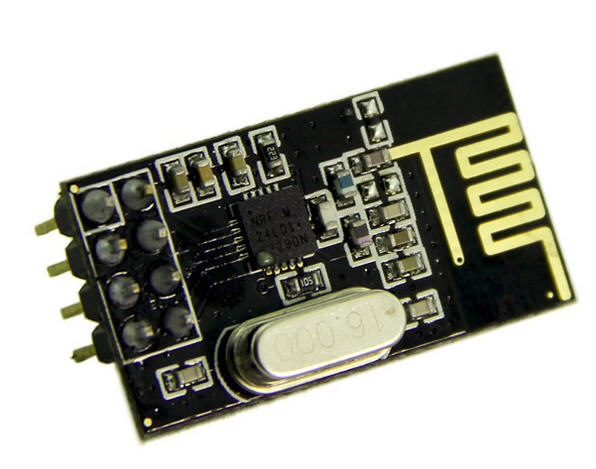
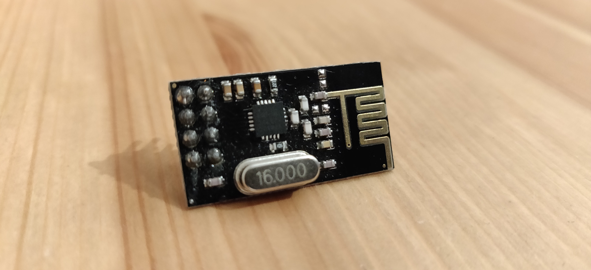

# NRF24_Messenger
Celem projektu jest utworzenie komunikatora za pomocą KL05 oraz modułu radiowego NRF24L01 obsłużonego za pomocą napisanej przez nas biblioteki. Biblioteka ta będzie posiadała podstawowe funkcje do wysyłania i odbierania danych oraz informowania o zaistniałych błędach i ich prawdopodobnych przyczynach.

## Analiza problemu
Komputer z płytką potrafi komunikować się za pomocą dostępnego na KL05 UART0. Należy więc w naszej bibliotece obsłużyć za pomocą UART0 komunikację między komputerem, a płytką. Ważny jest fakt, że UART0 wysyła ciąg znaków zakodowany w ASCII. Konwersja ze znaków ASCII musi się więc odbyć po stronie odbiorcy. Płytka potrafi komunikować się z radiem poprzez SPI. Więc w bibliotece musi być obsłużona komunikacja SPI. Z połączeniem radia i płytki wiąże się wiele błędów nie tylko z fizyczmym połączeniem kablami, ale również w kodzie np. wybór kanału przesyłu. Należy więc bibliotekę uzbroić w obsługę wszelkich błędów wraz z odpowiednimi do nich wskazówkami.

## Plan realizacji
Do kumunikacji między płytką, a komputerem użyty zostanie UART0 dostępny na płytce KL05. Natomiast komunikacja między radiem, a płytką zostanie obsłużona za pomocą SPI. UART0 pozwoli na wysyłanie z komputera dowolnego ciągu znaków na płytkę KL05, która następnie przez SPI będzie przesyłać sygnał do radia. Drugie radio umieszczone na osobnej płytce będzie dane odbierać i przekazywać powrotną informację potwierdzającą udaną transmisję. Użytkownik za pomocą dowolnego terminalu powinien mieć możliwość wysłania dowolnej informacji na dany port w komputerze, do którego podpięty jest układ. Układ powinien przesłać informacje do drugiego układu oddalonego na nie więcej niż 10 metrów. 

# Video with final result

